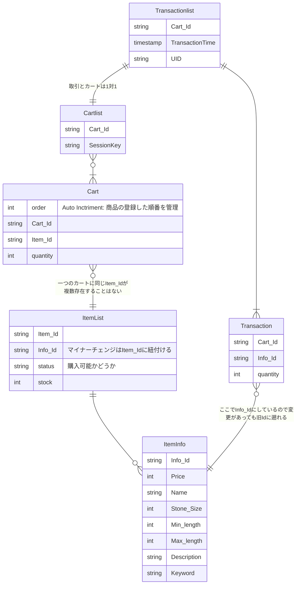
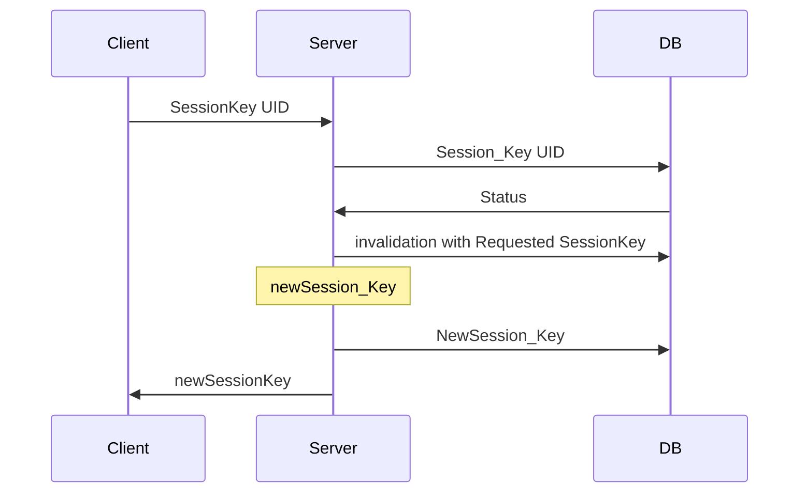
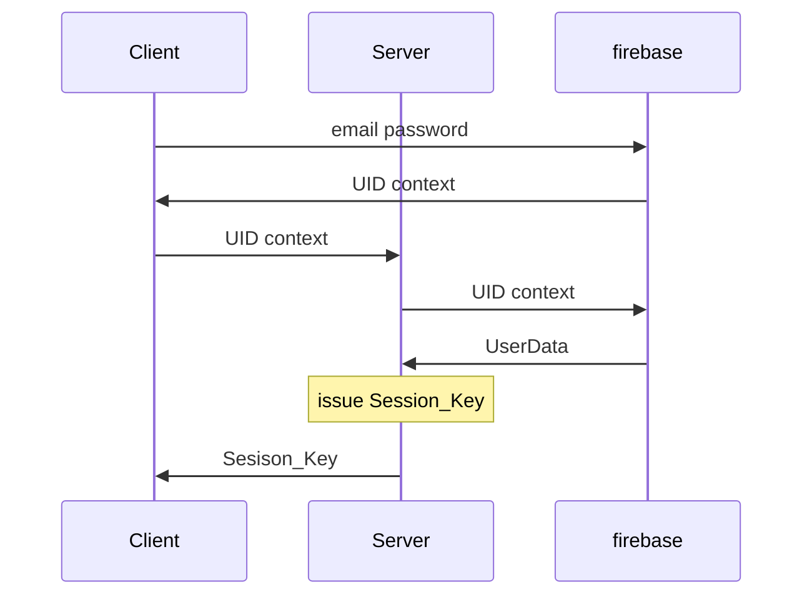
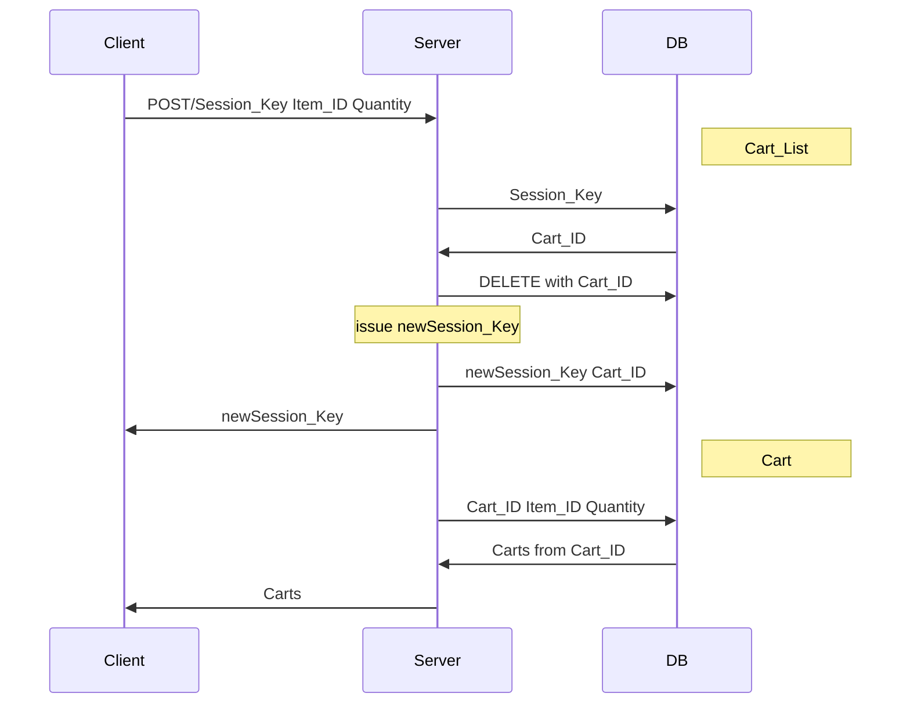

# gin-server

**これは golang ベースで作られた開発中のバックエンドサーバです。**

今まで商品管理・アカウント・取引を別々に開発していましたが、今回はそれをすべて統合した形となります。

データ構造は次のようなものを考えています。

## カート・取引　データベース

```mermaid
erDiagram
Transactionlist ||--||Cartlist:"取引とカートは1対1"
Transactionlist ||--|{Transaction:""
Cartlist}o--|{Cart:""
Cart}o--||ItemList:"一つのカートに同じItem_Idが複数存在することはない"
ItemList||--o{ItemInfo:""
Transaction}o--||ItemInfo:"ここでInfo_Idにしているので変更があっても旧Idに遡れる"

Transactionlist{
 string Cart_Id
 timestamp TransactionTime
 string UID
}
Transaction{
 string Cart_Id
 string Info_Id
 int quantity
}

Cartlist{
 string Cart_Id
 string SessionKey
}

Cart{
 int order "Auto Inctriment: 商品の登録した順番を管理"
 string Cart_Id
 string Item_Id
 int quantity
}

ItemList{
 string Item_Id
 string Info_Id "マイナーチェンジはItem_Idに紐付ける"
 string status "購入可能かどうか"
 int stock
}
ItemInfo{
 string Info_Id
 int Price
 string Name
 int Stone_Size
 int Min_length
 int Max_length
 string Description
 string Keyword
}
```

## セッション

```mermaid
sequenceDiagram

participant Client
participant Server
participant DB

Client ->> Server:SessionKey UID
Server ->> DB:Session_Key UID
DB ->> Server:Status
Server ->> DB:invalidation with Requested SessionKey
Note over Server: newSession_Key
Server ->> DB:NewSession_Key
Server ->> Client:newSessionKey


```

## ログイン

```mermaid
sequenceDiagram
participant Client
participant Server
participant firebase


Client ->> firebase:email password
firebase ->> Client: UID context
Client ->> Server: UID context
Server ->> firebase:UID context
firebase ->>Server:UserData
Note over Server:issue Session_Key
Server ->> Client:Sesison_Key

```

## カート管理

```mermaid
sequenceDiagram
participant Client
participant Server
participant DB

Client ->> Server:POST/Session_Key Item_ID Quantity
Note right of DB:Cart_List
Server ->> DB:Session_Key
DB ->> Server:Cart_ID　
Server ->> DB:DELETE with Cart_ID
Note over Server:issue newSession_Key
Server ->> DB:newSession_Key Cart_ID
Server ->> Client:newSession_Key
Note right of DB:Cart
Server ->> DB:Cart_ID Item_ID Quantity
DB ->> Server:Carts from Cart_ID
Server ->> Client:Carts
```
