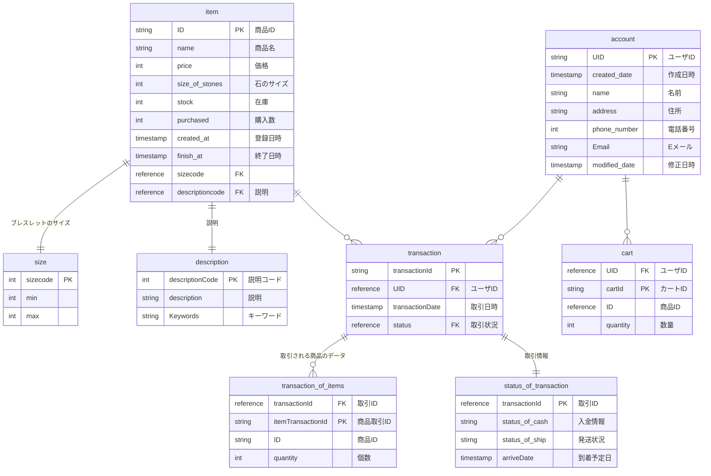

# gin-server

**これは golang ベースで作られた開発中のバックエンドサーバです。**

今まで商品管理・アカウント・取引を別々に開発していましたが、今回はそれをすべて統合した形となります。

データ構造は次のようなものを考えています。

```mermaid
erDiagram 

item ||--|| size:"ブレスレットのサイズ"
item ||--|| description:"説明"
transaction ||--o{ transaction_of_items:"取引される商品のデータ"
item ||--o{ transaction:""
transaction||--||status_of_transaction:"取引情報"
account ||--o{transaction:""
account ||--o{cart:""

item{
	string ID PK "商品ID"
	string name "商品名"
	int price "価格"
	int size_of_stones"石のサイズ"
	int stock "在庫"
	int purchased "購入数"
	timestamp created_at"登録日時"
	timestamp finish_at "終了日時"
	reference sizecode FK 
	reference descriptioncode FK "説明"
}
size{
	int sizecode PK
	int min
	int max
}
description{
	int descriptionCode PK "説明コード"
	string description "説明"
	string Keywords "キーワード"
}
transaction{
	string transactionId PK
	reference UID FK "ユーザID"
	timestamp transactionDate "取引日時"
	reference status FK "取引状況"
}
transaction_of_items{
	reference transactionId FK "取引ID"
	string itemTransactionId PK "商品取引ID"
  string ID "商品ID"
	int quantity "個数"
}
status_of_transaction{
	reference transactionId PK "取引ID"
	string status_of_cash "入金情報"
	stirng status_of_ship "発送状況"
	timestamp arriveDate "到着予定日"
}
account{
  string UID PK "ユーザID"
  timestamp created_date "作成日時"
  string name "名前"
  string address "住所"
  int phone_number "電話番号"
  string Email "Eメール"
  timestamp modified_date "修正日時"
}
cart{
  reference UID FK "ユーザID"
  string cartId PK "カートID"
  reference ID "商品ID"
  int quantity "数量"
}
```
