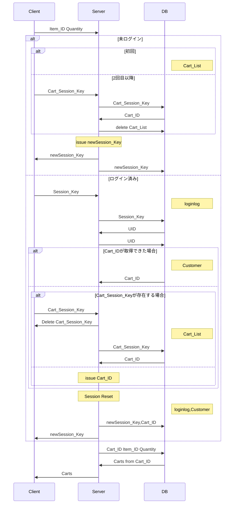

# gin-server

**これは golang ベースで作られた開発中のバックエンドサーバです。**

今まで商品管理・アカウント・取引を別々に開発していましたが、今回はそれをすべて統合した形となります。

## 構成

```mermaid
graph TD
client --- Nginx
subgraph  [Server]
Nginx --- FrontEndServer
FrontEndServer --- APIServer
APIServer --- DB
FrontEndServer --- BackEndServer
FireBaseAuth --- BackEndServer
BackEndServer --- DB
BackEndServer --- CashServer
CashServer --- Stripe
FrontEndServer --- FireBaseAuth
end

```

## フロー

### セッション


### ログイン


### カート管理

#### カート ID 取得フロー




## データ構造

### カート・取引　データベース


